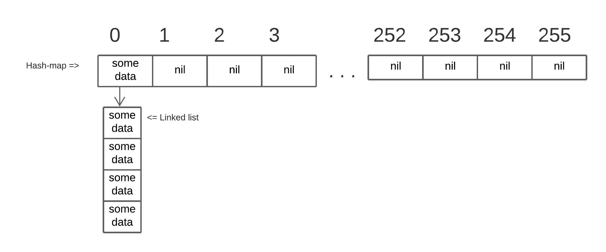

## **About**
Basic hash-map```[string]string``` on 8bit Pearson's hash-function.

## **How it worked**
An array of 255 elements of the ```*List``` type is reserved. <br>
The hash function has an output range ```[0 ... 255]``` of type ```int```. <br>
If there is a collision, the linked list is expanded by one element at the end.




## **Example**
<table>
  <tr>
    <td> <b>Code</b> </td> <td> <b>Output</b> </td>
  </tr>
  <tr>
  <td>

```go
// ...
// some code
func example() {
  data := Map{}
  data.insert("hello", "1")
  data.insert("world", "1")
  data.insert("hello", "2")
  data.insert("!", "3")

  fmt.Println(data.get_value("world"))
  fmt.Println(data.keys())
}
```
  </td>
  <td>

  ```bash
1
["hello" "world" "!"]
```
</td>
</tr>
</table>
